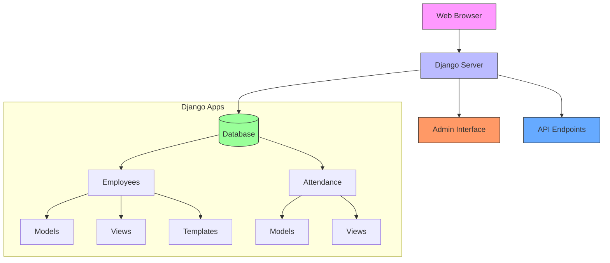

# 🏢 Employee Management System


[](LICENSE)

A complete **Django web application** for managing employee records, departments, and attendance tracking.

---

## 🌟 Features

| Feature                 | Description                        | Endpoint                       |
| ----------------------- | ---------------------------------- | ------------------------------ |
| 👥 Employee Management  | CRUD operations for employees      | `/admin/employees/`            |
| 🏛️ Department Tracking | Organize employees by department   | `/admin/employees/department/` |
| ⏱️ Attendance System    | Record daily check-ins             | `/admin/attendance/`           |
| 📊 Admin Dashboard      | Full-featured management interface | `/admin/`                      |

---

## 🚀 Quick Start

### ✅ Prerequisites

* Python 3.8+
* Git
* PostgreSQL (optional)

---

### 📦 Installation

1. **Clone the Repository**

```bash
git clone https://github.com/nethaxstark/employee-management.git
cd employee-management
```

2. **Set Up Virtual Environment**

```bash
# For Linux/Mac
python -m venv venv
source venv/bin/activate

# For Windows
python -m venv venv
.\venv\Scripts\activate
```

3. **Install Dependencies**

```bash
pip install -r requirements.txt
```

---

### 🗄️ Database Setup

```bash
python manage.py migrate
python manage.py createsuperuser
python manage.py seed_data  # Load sample data
```

---

### ▶️ Running the Application

```bash
python manage.py runserver
```

Now access the system at:
**[http://127.0.0.1:8000](http://127.0.0.1:8000)**

---

## 🗂️ Project Structure

```
employee-management/
├── .gitignore
├── README.md
├── requirements.txt
├── manage.py
├── employee_project/
│   ├── settings.py
│   ├── urls.py
│   └── wsgi.py
├── employees/
│   ├── models.py
│   ├── admin.py
│   └── management/
│       └── commands/
│           └── seed_data.py
└── attendance/
    ├── models.py
    └── admin.py
```

---

## 🔧 Configuration

### 📁 Environment Variables

Create a `.env` file in the root directory:

```ini
DEBUG=True
SECRET_KEY=your-secret-key-here
DATABASE_URL=sqlite:///db.sqlite3
```

---

### 💾 Database Options

#### ✅ SQLite (Default)

```python
DATABASES = {
    'default': {
        'ENGINE': 'django.db.backends.sqlite3',
        'NAME': BASE_DIR / 'db.sqlite3',
    }
}
```

#### 🏢 PostgreSQL (Recommended for Production)

```python
DATABASES = {
    'default': {
        'ENGINE': 'django.db.backends.postgresql',
        'NAME': 'employee_db',
        'USER': 'db_user',
        'PASSWORD': 'password',
        'HOST': 'localhost',
        'PORT': '5432',
    }
}
```

---

## 🖥️ Admin Interface

After creating a superuser, access the admin panel at:

📍 **/admin**

Admin UI

---

## 🌐 API Endpoints (Django REST Framework Required)

| Endpoint           | Method | Description              |
| ------------------ | ------ | ------------------------ |
| `/api/employees/`  | GET    | List all employees       |
| `/api/attendance/` | POST   | Create attendance record |

**Sample JSON Response:**

```json
{
  "id": 1,
  "name": "John Doe",
  "department": "Engineering",
  "email": "john@example.com"
}
```
## 📊 System Architecture


---

## 🛠️ Development

### 📌 Creating New Models

Example: Adding a Salary model

```python
class Salary(models.Model):
    employee = models.ForeignKey(Employee, on_delete=models.CASCADE)
    amount = models.DecimalField(max_digits=10, decimal_places=2)
```

**Generate migrations:**

```bash
python manage.py makemigrations
python manage.py migrate
```

---

## ✅ Testing

Run tests for all apps:

```bash
python manage.py test employees attendance
```

---

## 🚀 Deployment

### 📍 Deploy to Heroku

```bash
heroku create your-app-name
git push heroku main
heroku run python manage.py migrate
```

---

### 🐳 Docker Setup

**Dockerfile:**

```dockerfile
FROM python:3.9

WORKDIR /app

COPY . .

RUN pip install -r requirements.txt

CMD ["gunicorn", "employee_project.wsgi", "--bind", "0.0.0.0:8000"]
```

---

## 📜 License

This project is licensed under the **MIT License** – see the [LICENSE](LICENSE) file for details.

---

## 🤝 Contributing

1. Fork the repository
2. Create your feature branch: `git checkout -b feature/AmazingFeature`
3. Commit your changes: `git commit -m 'Add some AmazingFeature'`
4. Push to the branch: `git push origin feature/AmazingFeature`
5. Open a Pull Request

---


